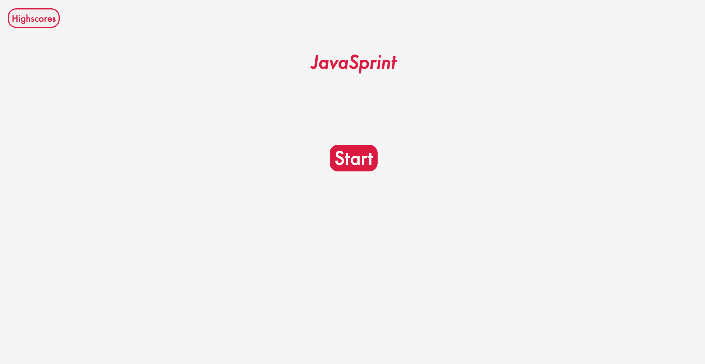

# JavaSpring

## About

  The JavaSprint quiz is a quiz that uses HTML, CSS, JavaScript, and Web-API technology to quiz users on JavaScript knowledge in an interactive interface. Users are awarded a point for each correctly answered question and are penalized time from the time remaining if answering incorrectly.

  The site may be accessed at: [its GitHub page url](https://anth8nyc.github.io/javasprint/).